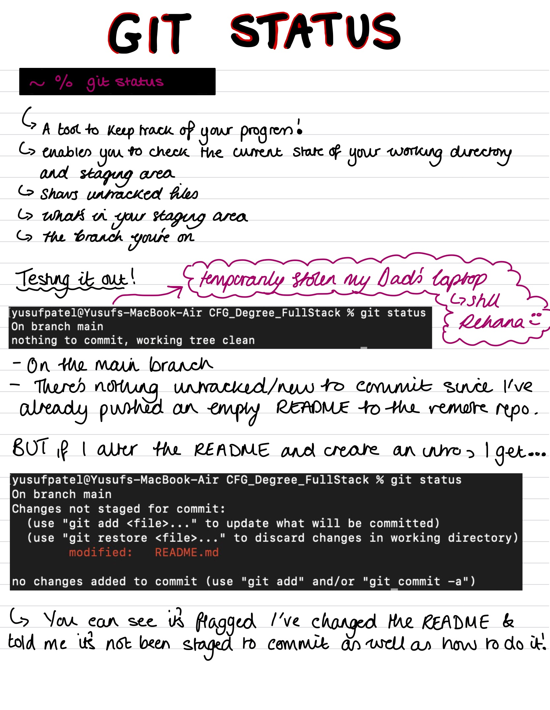
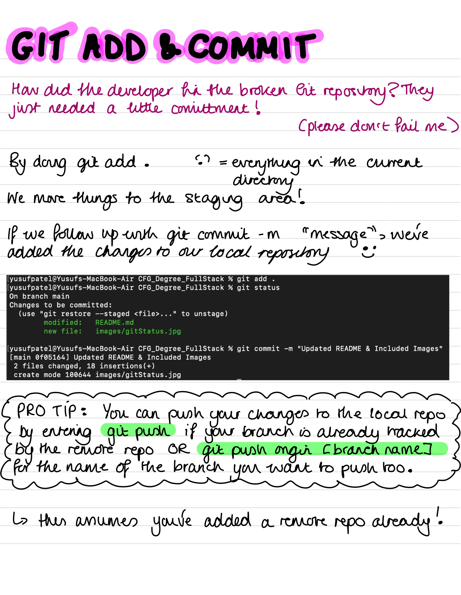
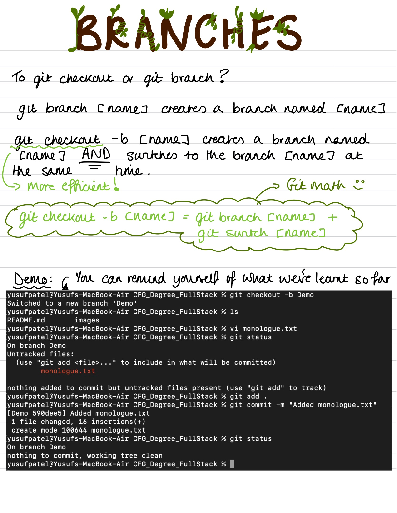
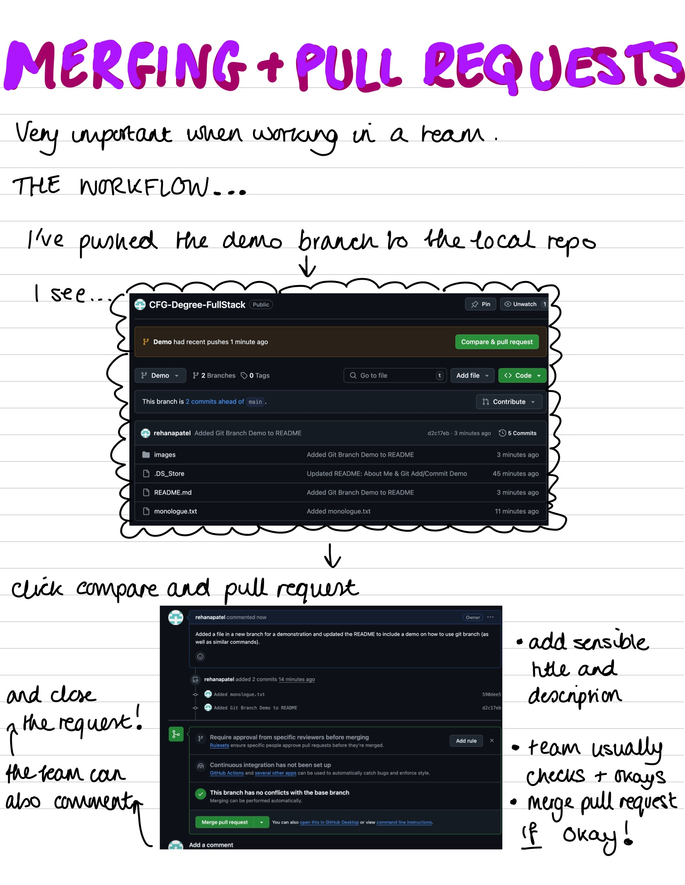
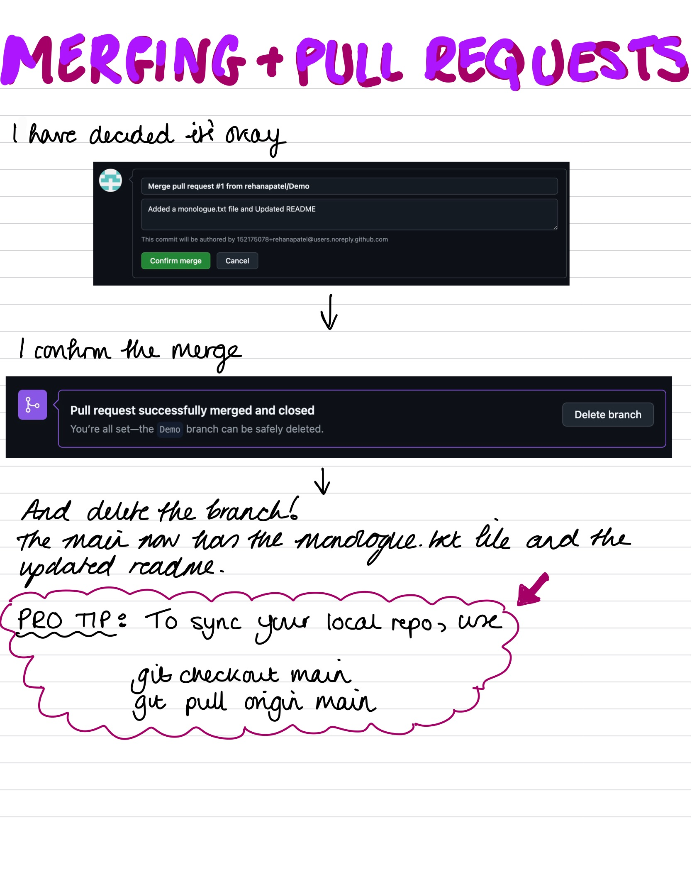

# Welcome to My GitHub Repository! 

## About Me

I'm a graduate physcist and MASSIVE coffee lover, hoping to become a coding wizard and break into the world of technology! I also tutor on the side and so have set the assignment up as if I am creating a tutorial for my students (or myself as I can be forgetful). 

Yes my love for coffee is in fact essential and useful information about me.

## The Purpose of This Repository and README File

In this repository I hope to carry out multiple CFG Degree Assignments including Assignment 1! This *README* is for **Assignment 1** and will contain a comprehensive tutorial on the following git commands/practises (in no particular order):

- git status
- git add
- git checkout
- git branch
- git commit
- adding files to branches
- pull requests
- merges
- useful files

In this repository are the example files I've used for the tutorial and a folder of images that you'll seecrop up in the *README* :). This tutorial assumes you've already created a remote repository and linked itto a local repository on your local machine (laptop, PC). Happy Coding!  

## How to Use Git Status


## How to Use Git Add & Git Commit


## How to Use Git Branch: Creating Branches and Adding Files to Them


## How to Carry Out a Pull Request & Merge to the Main Branch

But the fun doesn't stop there...


## Other Files
There are two files we will consider, the first is:
> .gitignore
The primary purpose is to tell Git which files or directories it should ignore and not track. It can prevent clutter, exclude sensitive information, allow for temporary files, and even let everyone ignore the same files if they have the same .gitignore!

The second file we will consider is:
> requirements.txt
It allows users to install the necessary packages/dependencies that your code uses to run. Here is where we make it clear what packages our projects rely on and what tools/libraries are neccessary. When people clone you repo, they can set up their environment by running:
```
pip install -r requirements.txt

```
(provided you configured the requirements.txt file correctly and their machine is set up to do so)

## Formatting Your READMEs
You have a multitude of formatting options. Here are some demonstrations:
A Code Block
```
git status
git checkout -b Demo
git switch main

```
Things in Bold and Italic
*** THIS IS INTENSE ***

You Can Strikethrough
~~ Oops a mistake ~~

You Can Have Subscript and Superscript
<sub> teeny tiny </sub>
<sup> teeny tiny </sup>

and so much more :)

I hope you've enjoyed the tutorial - stay tuned for more! 


