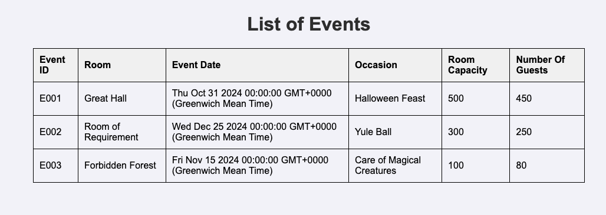
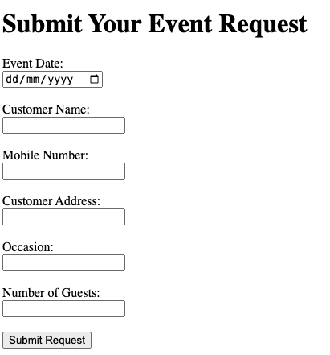
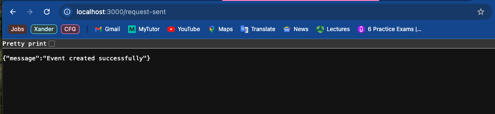
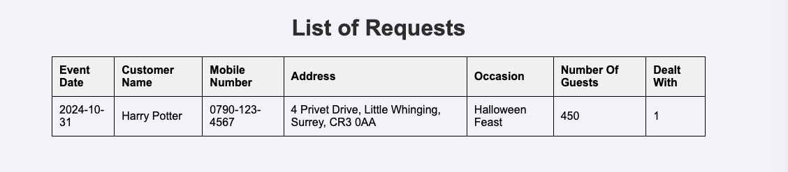
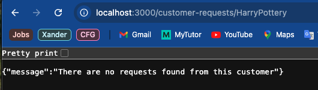

# Hogwarts Event Booking API

This Node.js application provides an API for managing events and event requests at Hogwards School of Witchcraft & Wizardry. 
It allows users to:
- View all currently booked events.
- Submit new event requests.
- Retrieve event requests made by specific customers.

## Table of Contents
1. [Prerequisites](#prerequisites)
2. [Project Setup](#project-setup)
3. [Environment Configuration](#environment-configuration)
4. [Database Setup](#database-setup)
5. [Running the Application](#running-the-application)
6. [API Endpoints](#api-endpoints)
7. [Error Handling](#error-handling)
8. [Example Requests and Responses](#example-requests-and-responses)

## Prerequisites
Before you start, ensure you have the following installed:
- [Node.js](https://nodejs.org/en/download/) (version 14.x or higher)
- [MySQL](https://dev.mysql.com/downloads/installer/)
- [Git](https://git-scm.com/)

## Project Setup
**Step 1: Clone the repository/ Download the files to your local computer**:
- Click on the green Code button
- Copy the HTTPS URL (https://github.com/rehanapatel/CFG-Degree-FullStack.git)
- Open your terminal and run:
```
git clone https://github.com/rehanapatel/CFG-Degree-FullStack.git
cd cfg-assignment-4-API
```
**Step 2: Install Dependencies (various packages)**:
- Install the required packages using the following npm install command:
```
npm install express dotenv morgan mysql2
```

## Environment Configuration
In order to work with your SQL database without uploading any of my personal data (root password etc), I have added my sqlConfig.env to the .gitignore and so it has been ignored by git. Thus it is not included here. 

Provided is an example *sqlConfig.env* file with the extension *.example* so it would not be ignored. Please configure this to suit your inputs and then remove the *.example* extension. 
Do not change the name of the file as it is hardcoded to recognise *sqlConfig.env*
Please note that this API is designed to connect with the database on the default 3306 port. If you cannot use the default port, you will have to add:
```
DB_PORT=PORT_NUMBER
```
to the sqlConfig.env file and you will have to edit
```
const pool = mysql.createPool({
    host: process.env.DB_HOST,
    user: process.env.DB_USER,
    password: process.env.DB_PASSWORD,
    database: process.env.DB_NAME,
    port: process.env.DB_PORT,    <<<<<<< 
    waitForConnections: true,
    connectionLimit: 10,
    queueLimit: 0
});

```
in the EventsApp.js file. (The arrows indicate the new addition)

## Database Setup
Make sure MySQL is installed and running. Then open MySQL Workbench and run the SQL script (the extension is *.sql*).
This creates the database and tables. 
You should see the following tables: 
- Events
- Requests
- Customers

## Running the Application
To start the server, use the following command:
```
npm start
```
The server is set to run on the 3000 port. If you wish to change this, you need only change the line:
```
const PORT = 3000;
```
in the EventsApp.js file (line 6).

## API Endpoints
In future, it would be good to consider implementing the *DELETE* and *UPDATE* HTTP methods to make this fully functional and practical. However, at this time, the following endpoints have been configured:
- GET /events
- GET /make-a-request
- POST /request-sent
- GET /customer-requests/:CustomerName
- GET /requests

**1. GET /events**
- Uses the method GET
- Returns a HTML page displaying the list of booked events
- Uses a select query

**2. GET /make-a-request**
- Uses the method GET
- Returns a HTML form where users can submit a new event request
- Upon the user clicking the submission button, it triggers the POST /request-sent route

**3. POST /request-sent**
- Uses the method POST
- Validates the user's inputs
- Inserts the user's inputs into the requests table of the SQL database

**4. GET /customer-requests/:CustomerName**
- Uses the method GET
- Uses the path parameter: CustomerName
- Returns a HTML page displaying the list of event requests made by the specified customer

**5. GET /requests**
- Uses the method GET
- Returns a HTML page displaying all event requests in the system

## Error Handling
The API includes error handling for the following cases:
- **400 Bad Request**
  Returned when the validation of input data fails such as missing or invalid fields.
- **404 Not Found**
  Returned when a resources cannot be found such as when no requests are found for a customer.
- **500 Internal Server Error**
  Returned when their is a server error such as a database connection failure.

For errors, the API returns a JSON response such as:
```
{
    "error": "Event Date must be a valid future data"
}
```

You'll also see the following status codes:
- **200 OK Status**
  Returned when the request from the client was successfully recieved, understood and processed by the 
  server.
- **201 Created Status**
  Returned when the request was successful and a new resource has been created.

## Example Requests and Responses
**1. GET /events**
For when the user wants to display the events currently proccessed and confirmed as booked.
Open your browser and enter the following URL:
 ```
http://localhost:3000/events
```
You'll see:



**2. GET /make-a-request**
For when the user would like to request a booking for an event. 
Open your browser and enter the following URL:
```
http://localhost:3000/make-a-request
```
You'll see:



**3. POST /request-sent**
You do not need to enter this URL, this will be automatically switched for you upon clicking the 'Submit Request' button when using the previous route.

Upon clicking submit, you'll see:



**4. GET /customer-requests/:CustomerName**
For when the user wants to check how many bookings are under a Customer's name.
There are a couple of ways you can do enter the URL, here are some examples:
Please not to NOT include the colon in the URL.

*Including the space between the first and last name*
The space will automatically change to %20
```
http://localhost:3000/customer-requests/Harry Potter
http://localhost:3000/customer-requests/Harry%20Potter
```
*Without the space between the first and last name*
```
http://localhost:3000/customer-requests/HarryPotter
```

As long as it is accurate to the string entered in the database, it will return any requests under the customer name:


If you mistype or input a name that does not exist in the Requests table, you'll see:



**5. GET /requests**
For when the user wants to check a newly created request or to see the table of requests.
Use the URL:
```
http://localhost:3000/requests
```
You'll see:


Note this is dependent on any requests made. You'll see in the above example, 5 additional requests were added via the API. As such, they are marked as FALSE in the DealtWith column.

Happy Organising! 
